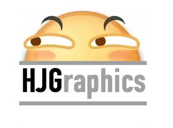
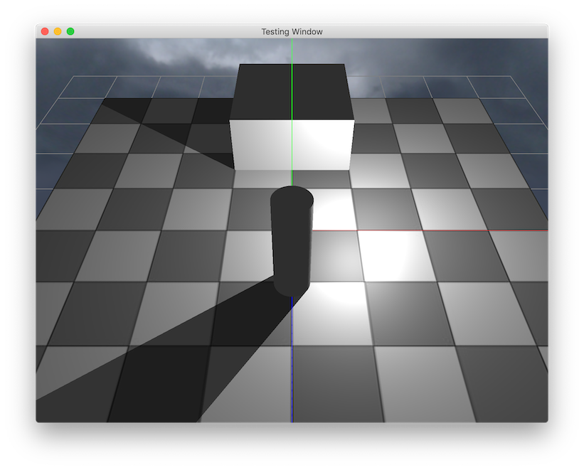
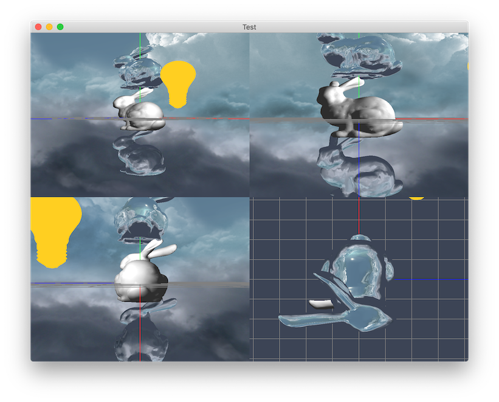

# HJGraphics
HJGraphics is a very simple 3D graphic framework based on OpenGL API, and my attempt to build a relatively complete tiny 3D graphic framework from the ground up. It is a part of my graduation project as well.

By using HJGraphics, you can create OpenGL environment and draw some funny 3D objects with  a few lines of code.
eg.
```
Box box(2,2,2);
Camera camera(cameraPos,cameraDirection);
PointLight pointLight(glm::vec3(-1.0f,3.0f,0.5f));
Scene scene;
scene.addCamera(camera);
scene.addObject(box);
scene.addLight(pointLight);
scene.draw();
```

# Features
HJGraphics has...

* Window : a GLFW wrapped window system.
* Camera 
* Scene : an easy way to manage and draw objects.
* Object : a few build-in 3D objects support include
    * Model 
    * Basic geometries like cylinder, box and plane. 
    * Skybox
    * Coordinate and grid
* Light : build-in basic lights support and unlimited number of lights in a single scene.
    * Point light
    * Parallel light
    * Spot light
    * Shadow for 3 kinds of lights above 
* Material : basic material support like diffuse map, specular map, normal map and height map.

# Gallery

<center>Fig.1 unlimited number of lights support</center>

<center>Fig.2 shadow support</center>

<center>Fig.3 model loading support (only `obj` format fully supported now)</center>

<center>Fig.4 basic material</center>
# Continue advancing
- [ ] SSAO
- [ ] Load scene via JSON file
- [ ] HDR
- [ ] Deferred shading option

# Acknowledge
Amazing tutorials : [learnopengl.com](https://www.learnopengl.com)

OpenGL API reference : [OpenGL wiki](https://www.khronos.org/opengl/wiki/)

Useful book : [OpenGL Programming Guide](https://book.douban.com/subject/26925331/)

