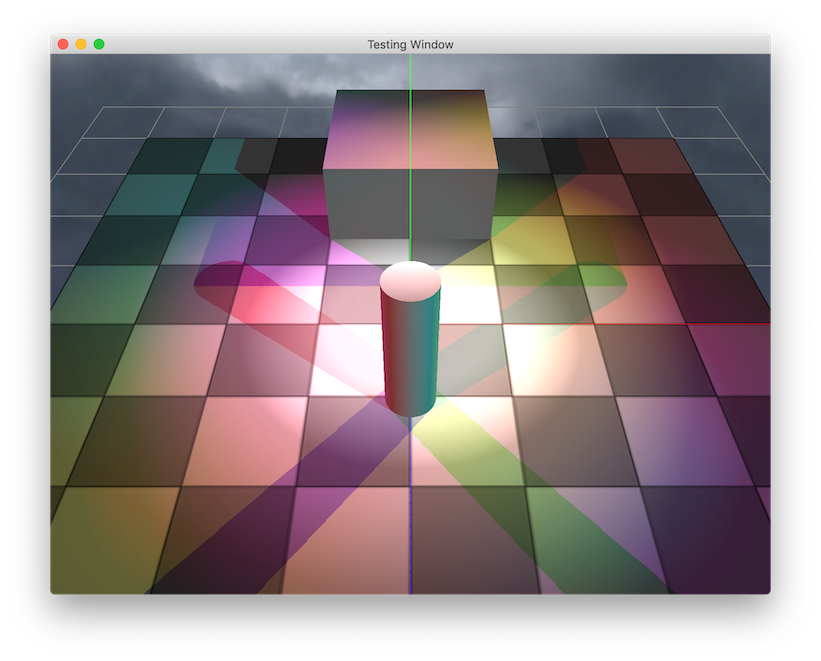
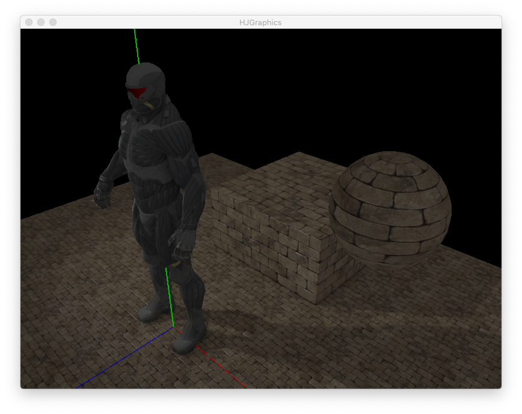

# HJGraphics
HJGraphics is a very simple 3D graphic framework based on OpenGL API, and also my attempt to build a relatively complete tiny 3D graphic framework from the ground up. It is a part of my graduation project as well.

By using HJGraphics, you can create OpenGL environment easily and draw some funny 3D objects with only a few lines of codes.

eg.
```
Window window(windowWidth,windowHeight,windowTitle);
Camera camera(cameraPosition,cameraDirection);
auto box=make_shared<Box>(boxWidth,boxDepth,boxHeight);
auto pointLight=make_shared<PointLight>(lightPosition);
auto scene=make_shared<Scene>();
scene->addCamera(camera);
scene->addObject(box);
scene->addLight(pointLight);
auto renderer=make_shared<DeferredRenderer>();
renderer->setMainScene(scene);
window.renderer=renderer;
window.run();
```

# Features
HJGraphics has...

* Window : a GLFW wrapped window system(~~now HJGraphics supports Qt, see HJGraphics-Qt~~).
* Camera 
* Scene : an easy way to manage and draw objects.
* Object : a few build-in 3D objects support include
    * Model 
    * Basic geometries like cylinder, box and plane. 
    * Skybox
    * Coordinate and grid
* Light : build-in basic lights support and unlimited number of lights in a single scene.
    * Point light
    * Parallel light
    * Spot light
    * Shadow for 3 kinds of lights above 
* Material : basic material, diffuse map, specular map, normal map and height map.
* Renderer : deferred and forward shading support, HDR rendering, SSAO, post-processing, text rendering.
# Gallery


Fig.1 unlimited number of lights and shadow support




Fig.2 model loading support (only `obj` format fully supported now)


Fig.3 basic material
# Dependencies
- Assimp 5.0.1 64bit
- GLFW 3.3 64bit
- GLAD
- glm
- stb
# Continue advancing
- [x] SSAO
- [ ] Load scene via JSON file
- [x] HDR
- [x] Deferred shading
- [ ] PBR Shading

# Acknowledge
Amazing tutorials : [learnopengl.com](https://www.learnopengl.com)

OpenGL API reference : [OpenGL wiki](https://www.khronos.org/opengl/wiki/)

Useful book : [OpenGL Programming Guide](https://book.douban.com/subject/26925331/)

